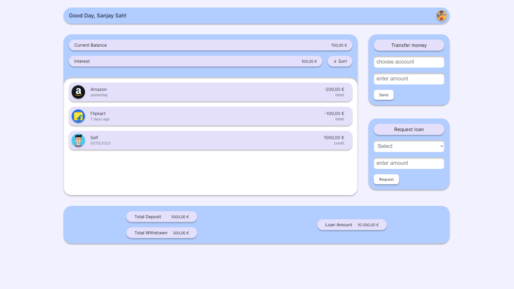
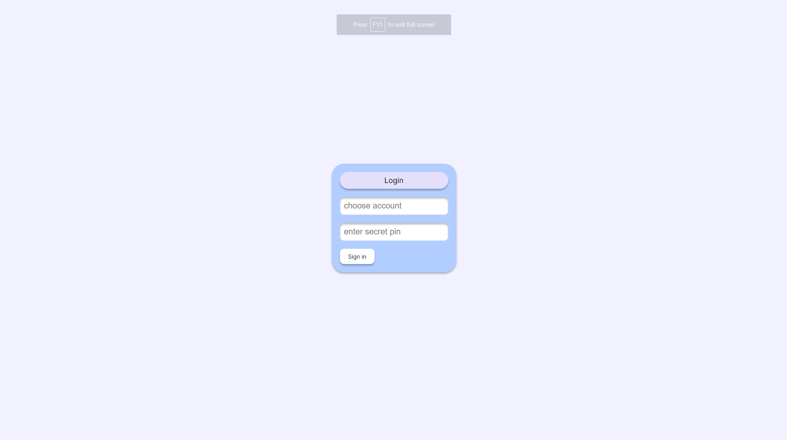

# Bankist App

Bankist is an online banking app. It allows users to: 

- Log in with a username and password
- View and sort transactions
- Transfer money to another account
- Request a bank loan
- switch account
- view Loan amount & transaction summary

## Built with

- Semantic HTML5 markup
- CSS3
- Vanilla JavaScript
- internationalization api

## Test Username and PIN

<table>
    <thead>
        <tr>
            <th>Username</th>
            <th>Pin</th>
        </tr>
    </thead>
    <tbody>
        <tr>
            <td>Sanjay</td>
            <td>1111</td>
        </tr>
        <tr>
            <td>Amazon</td>
            <td>2222</td>
        </tr>
        <tr>
            <td>flipkart</td>
            <td>3333</td>
        </tr>
    </tbody>
</table>

## Screenshots

